# RunTimeBay (APIBay)

**RunTimeBay** 是一个轻量级的**HTTP网关服务**，专为中小型项目和多服务整合场景设计。它同时也是一个**插件化的子业务运行时**，支持通过插件扩展日志、静态资源、站点地图等功能。

### 初学者怎么读这份文档？

| 你想… | 先看 |
|--------|------|
| 5 分钟搞懂「这是个啥」 | [§1 用大白话解释](#1-它到底是什么) |
| 在本机跑起来 | [§5 快速开始](#5-快速开始) + [§2.9 本机部署图](#29-本机开发部署图) |
| 看懂请求怎么转发 | [§2.3 网关转发时序图](#23-http-网关转发时序图) + [§2.15 一张图看懂数据流](#215-一张图看懂数据流初学者) |
| 写自己的插件 | [§6 计算器示例](#6-完整示例创建一个计算器插件) + [§2.13 插件开发流程图](#213-插件开发流程图) |
| 搞懂主面板 / RomBay | [§8 与主面板的协作](#8-与主面板的协作) |
| 查全部图 | [§2 图表索引](#2-整体架构) 下方表格 |

---

## 1. 它到底是什么？

### 1.1 用大白话解释

**场景一：个人项目**

你写了一个后端 API，端口是 `3000`。如果没有网关：
- 用户只能直接访问 `http://你的IP:3000`
- 暴露了真实架构和端口，安全隐患大
- 以后想换端口？用户地址全得改

有了 RunTimeBay（Router）：
```
用户请求  http://localhost:8081/api/users
              ↓
         【RunTimeBay 网关：8081端口】
              ↓ 根据路由规则
         转发到 127.0.0.1:3000
```

**好处：**
- 隐藏真实后端端口
- 统一入口 `8081`，以后换服务用户无感知
- 可叠加日志、监控、权限等插件

**场景二：多服务整合**

假设你有三个后端服务：
- 用户服务：`localhost:3001`（处理 `/api/users` 相关请求）
- 订单服务：`localhost:3002`（处理 `/api/orders` 相关请求）
- 商品服务：`localhost:3003`（处理 `/api/products` 相关请求）

没有网关时：用户要记三个地址。

有网关时：用户只访问 `8081`，网关根据路径自动分发：

```
用户请求 http://localhost:8081/api/users
              ↓
    【Router 8081 根据路由规则匹配】
              ↓
    → /api/users  → 转发到 127.0.0.1:3001
    → /api/orders → 转发到 127.0.0.1:3002
    → /api/products → 转发到 127.0.0.1:3003
```

**场景三：接入主面板（多节点管理，可选）**

> **说明：** RomBay / 主面板**不在本仓库内**，是公司内网的**上层运维平台**。多数研发日常只用本机的 RunTimeBay（726 管理后台 + 8081 网关），**碰不到主面板是正常的**。详见 [§8 与主面板的协作](#8-与主面板的协作)。

若你们组织已部署 RomBay（或 AI 开发台、自研控制台），由**运维 / 平台 / 核心架构**通过主面板**批量管理多个 RunTimeBay 节点**：

```
【RomBay 主面板 - 控制中心】  ← 独立系统，非 RunTimeBay 安装包的一部分
     │
     ├── 统一下发配置（mysql.page、redis.page）
     ├── 批量操作（启动/停止插件、添加路由）
     └── 监控节点状态
     │
     ├── RunTimeBay 节点A（192.168.1.10:8081）
     ├── RunTimeBay 节点B（192.168.1.11:8081）
     └── RunTimeBay 节点C（192.168.1.12:8081）
```

主面板通过各节点 **726 端口的 HTTP API** 下发指令，实现**一套配置、多节点生效**。没有主面板时，在单机上用 DocApier（726）完成同等操作即可。

---

### 1.2 技术定义

| 术语 | 含义 |
|------|------|
| **HTTP 网关 / 反向代理** | 位于用户和后端服务之间的中间层，接收用户请求后**按规则转发**到对应的后端服务。对用户透明。 |
| **Router** | RunTimeBay 内置的 HTTP 网关模块，监听 **8081 端口**，负责请求转发。 |
| **DocApier** | RunTimeBay 内置的**控制面**，监听 **726 端口**，提供 API 元数据管理和插件管理功能。 |
| **Plugin / Plugs** | 可插拔的子服务，以独立进程运行，通过 Router 暴露到外部。 |
| **API 元数据** | 描述 API 路径、参数、返回值结构的数据，存储在 `DocApier/Data/api_data.json`。 |

---

## 2. 整体架构

> 以下图表根据当前仓库源码绘制（`index.js`、`Router/`、`DocApier/`、`Plugs/`、`utils/`）。在支持 Mermaid 的 Markdown 预览器（GitHub、VS Code 插件、Typora 等）中可直接渲染。

### 图表索引（初学者可当目录用）

| 编号 | 图名 | 适合谁 |
|------|------|--------|
| 2.1 | 系统组件架构图 | 了解有哪些模块 |
| 2.2 | 进程启动时序图 | 理解 `npm start` 后发生了什么 |
| 2.3 | HTTP 网关转发时序图 | 理解 8081 怎么转发 |
| 2.4 | 插件启动时序图 | 理解「启动插件」背后流程 |
| 2.5 | 路由热重载时序图 | 理解改路由为何自动生效 |
| 2.6 | API 元数据管理时序图 | 理解 726 里 API 文档存哪 |
| 2.7 | 模块依赖关系图 | 改代码时知道该动哪个文件 |
| 2.8 | 主面板多节点协作图 | 有公司级运维时再看 |
| **2.9** | **本机开发部署图** | **初学者必看：你电脑上跑什么样** |
| **2.10** | **生产/服务器部署拓扑图** | 上线后机器上有什么 |
| **2.11** | **端口与谁能访问** | 哪些端口能对外、哪些只本机 |
| **2.12** | **初学者学习路径** | 按顺序学什么 |
| **2.13** | **插件开发流程图** | 从新建到通过网关访问 |
| **2.14** | **开发环境 vs 生产环境** | Elua、端口开放差异 |
| **2.15** | **一张图看懂数据流** | 最简请求路径 |
| 2.16 | 路由匹配规则详解 | 最长前缀匹配举例 |

### 2.1 系统组件架构图

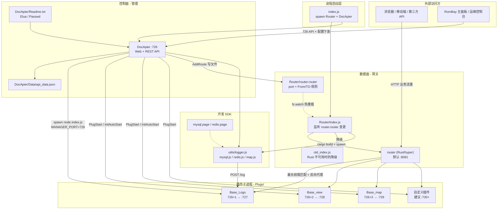

**端口与职责（与代码一致）：**

| 组件 | 端口 | 源码入口 |
|------|------|----------|
| Router 网关 | `router.router` 中 `port:`，默认 **8081** | `Router/src/main.rs`（经 `Router/index.js` 拉起） |
| DocApier 控制面 | **726** | `DocApier/index.js` |
| Base_Logs | **727**（`MANAGER_PORT+1`） | `Plugs/Base_Logs/index.js` |
| Base_view | **728**（`MANAGER_PORT+2`） | `Plugs/Base_view/index.js` |
| Base_map | **729**（`MANAGER_PORT+3`） | `Plugs/Base_map/index.js` |
| 自定义插件 | `info.plug` 声明 + `index.js` 内 `listen` | `Plugs/<name>/index.js` |

### 2.2 进程启动时序图

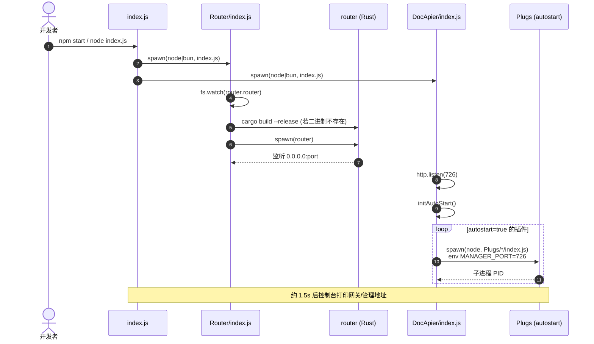

### 2.3 HTTP 网关转发时序图

用户访问 `http://localhost:8081/api/users?id=1` 时（Rust 网关路径，`Router/src/main.rs`）：

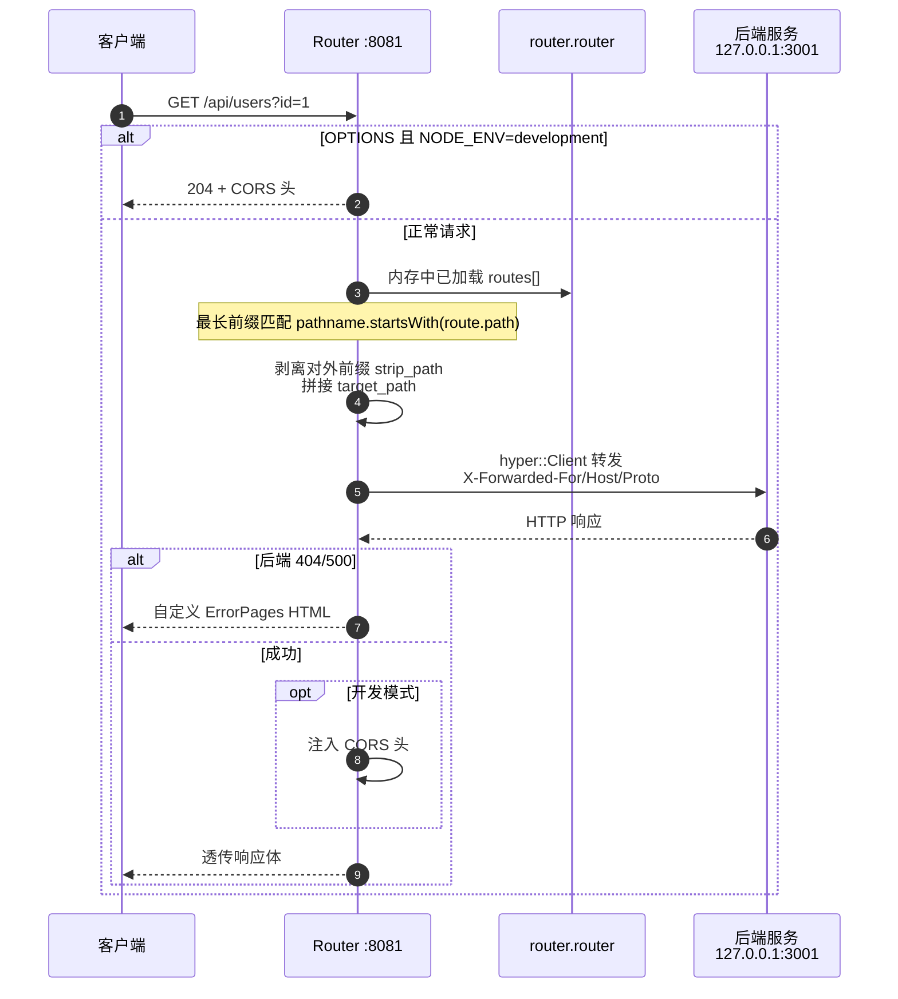

**路径改写规则（`proxy_request`）：** 对外路径 `/api/users` 匹配后，会去掉前缀再转发；若目标写成 `127.0.0.1:3001/v1`，则剩余路径会拼到 `/v1` 之后。

### 2.4 控制面：插件启动时序图

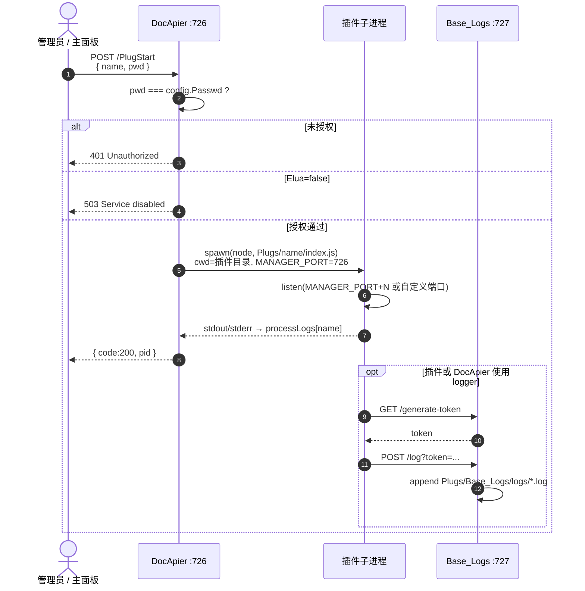

### 2.5 控制面：路由配置与热重载时序图

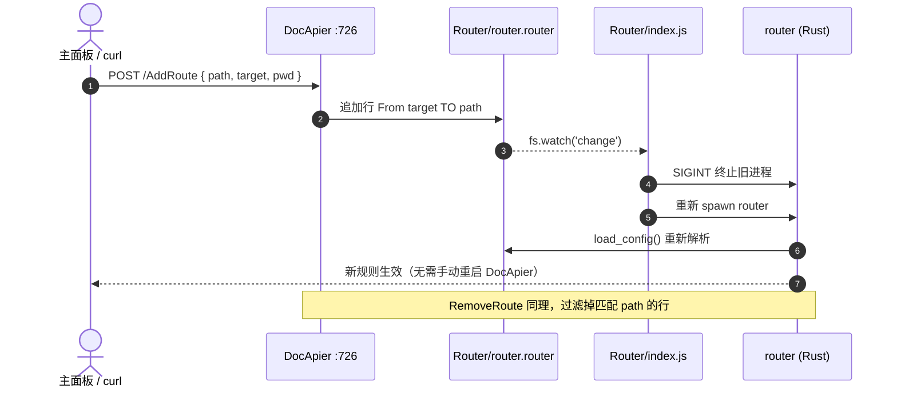

### 2.6 API 元数据管理时序图

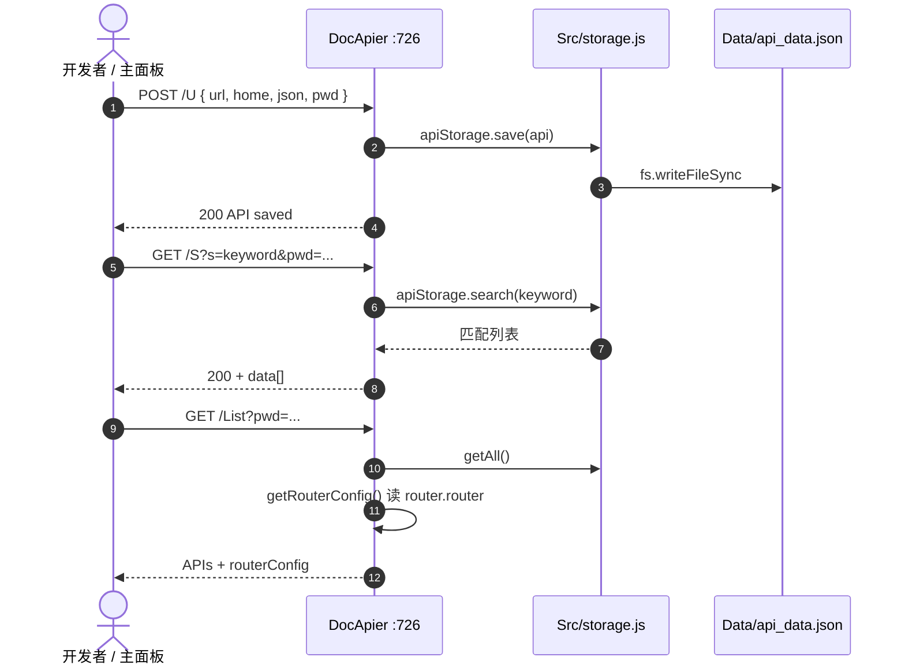

### 2.7 模块依赖关系图

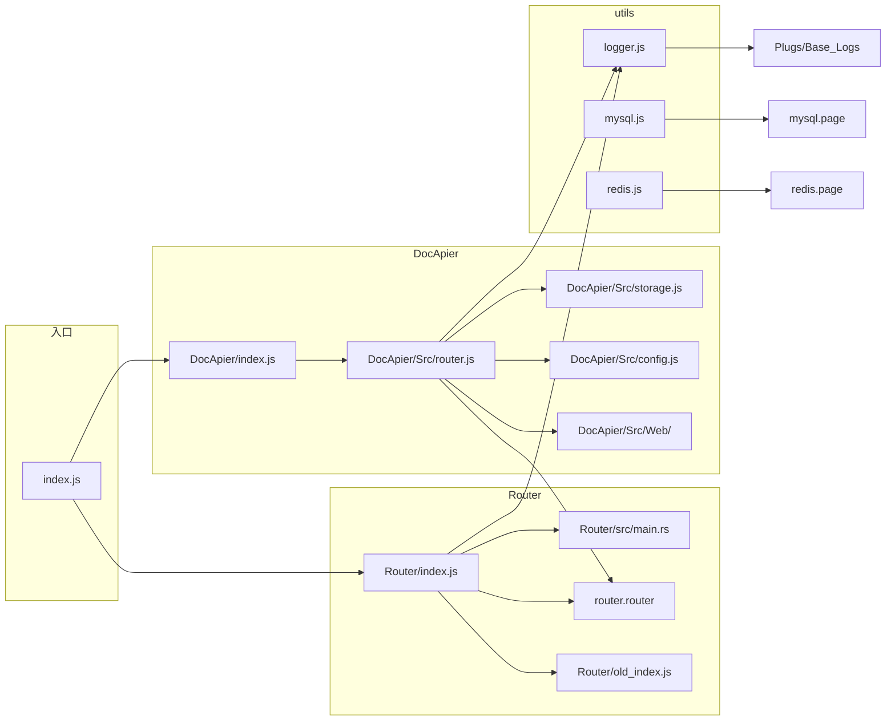

### 2.8 主面板多节点协作图

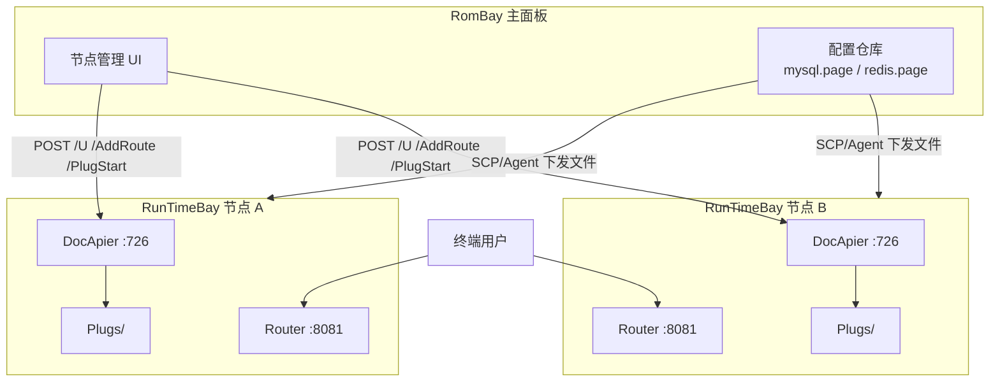

### 2.9 本机开发部署图

**这是你作为初学者最常见的情况**：在一台电脑上 `git clone` 后 `npm start`，所有进程都在本机 `127.0.0.1`。

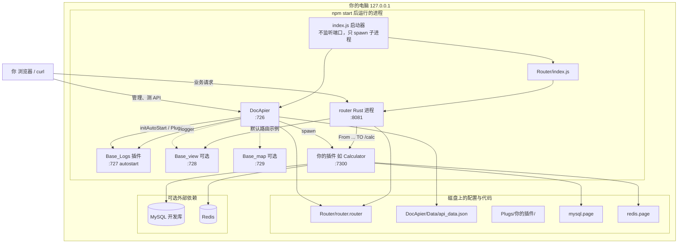

**记住三件事：**

1. **只跑一条命令**：在项目根目录 `npm start`，不必分别进 `Router/`、`DocApier/` 手动启动（除非你在调试单个模块）。
2. **两个你要常打开的地址**：管理用 **726**，对外联调用 **8081**。
3. **插件端口（727、7300…）一般不用在浏览器里直接记**：对外统一走 **8081 + 路由**。

### 2.10 生产/服务器部署拓扑图

单机开发只有一台「你的电脑」；**上线到 Linux 服务器**时，常见拓扑如下（与代码能力一致，防火墙策略由运维定）：

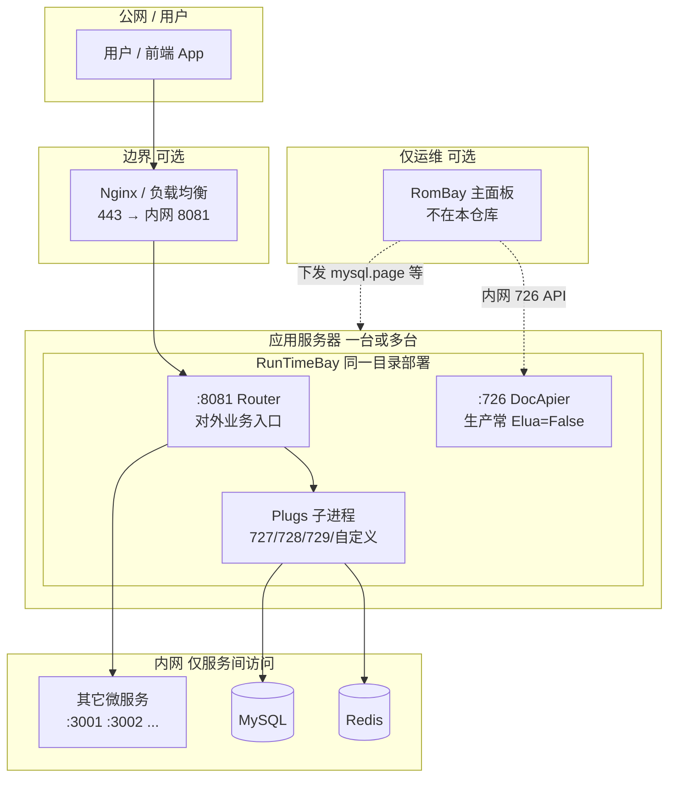

| 环境 | 典型做法 |
|------|----------|
| **本机开发** | 8081 + 726 都开，`Elua=True`，浏览器直接访问 |
| **测试服务器** | 8081 对内网开放；726 对开发组开放 |
| **生产服务器** | 只把 **8081**（或前面 Nginx）暴露给用户；726 关闭或仅跳板机/主面板可访问 |

### 2.11 端口与谁能访问

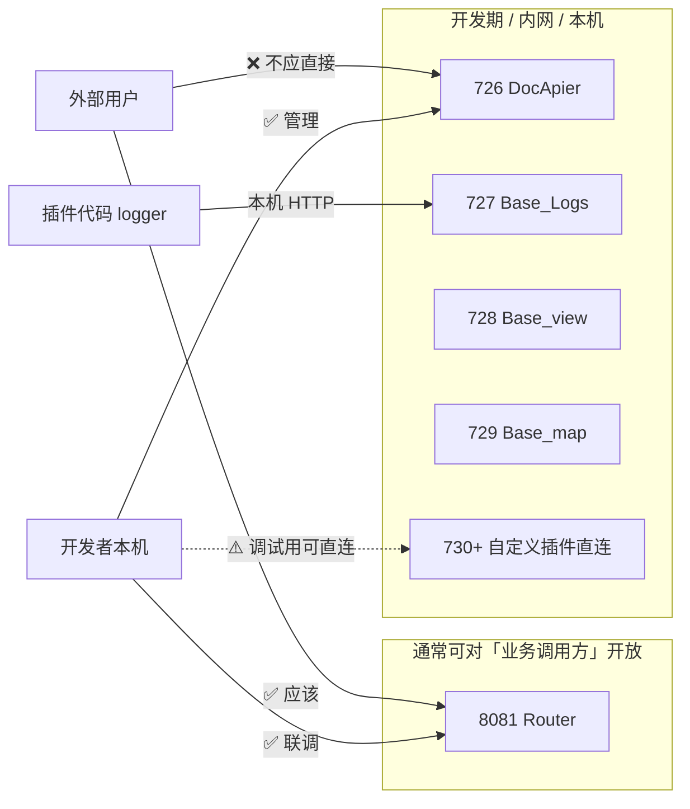

| 端口 | 服务 | 初学者要不要记 | 谁能访问 |
|------|------|----------------|----------|
| **8081** | 网关 | ✅ 要记 | 用户、前端、联调方（统一入口） |
| **726** | 管理后台 | ✅ 要记 | 仅开发者/运维（含密码） |
| **727–729** | 内置插件 | 知道即可 | 本机服务互调，不应对公网 |
| **730+** | 你的插件 | 开发时记 | 开发可直连；上线后走 8081 路由 |

### 2.12 初学者学习路径

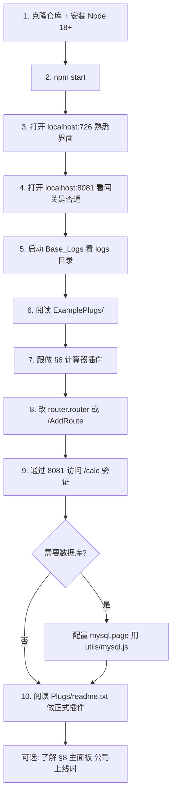

### 2.13 插件开发流程图

从「新建文件夹」到「用户能访问」的完整步骤（与 §6 计算器一致）：

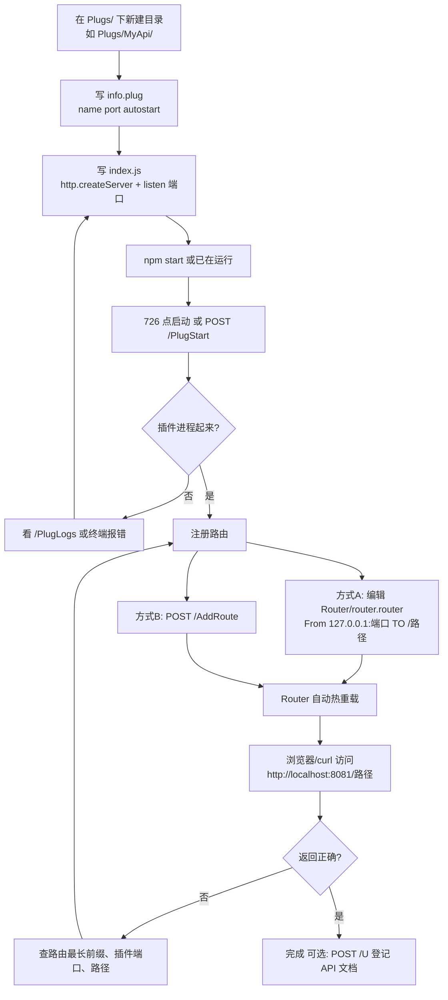

### 2.14 开发环境 vs 生产环境

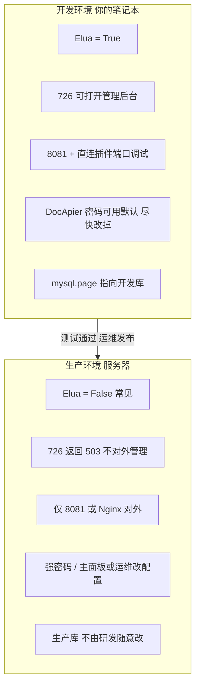

| 对比项 | 开发（初学者） | 生产 |
|--------|----------------|------|
| 启动 | `npm start` | 同上或 systemd/docker（团队规范） |
| 管理入口 726 | 常用 | 常关闭 |
| 网关 8081 | 常用 | **唯一对用户入口** |
| 改路由 | 自己改文件或 726 | 运维/主面板批量 |
| 主面板 RomBay | 一般没有 | 运维有，研发可能没有 |

### 2.15 一张图看懂数据流（初学者）

**忘掉其它细节时，只记这张图：**

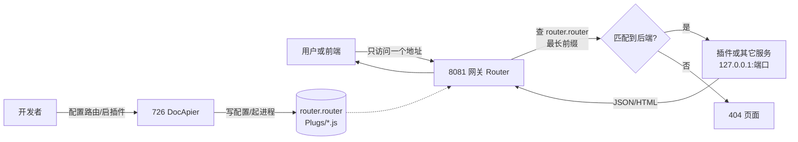

**类比：** 8081 是商场**大门**，726 是**办公室**（管哪家店开门、客人该去哪家店）；顾客只进大门，不进办公室。

### 2.16 路由匹配规则详解

Router 使用**最长前缀匹配**（Longest Prefix Match）算法：

假设路由配置如下（`Router/router.router`）：
```
From 127.0.0.1:3001 TO /api
From 127.0.0.1:3002 TO /api/users
From 127.0.0.1:3003 TO /api/users/admin
```

| 用户请求路径 | 匹配结果 | 转发目标 |
|--------------|----------|----------|
| `/api` | 匹配 `/api` | 127.0.0.1:3001 |
| `/api/users` | 匹配 `/api/users` | 127.0.0.1:3002 |
| `/api/users/123` | 匹配 `/api/users`（最长前缀） | 127.0.0.1:3002 |
| `/api/users/admin` | 匹配 `/api/users/admin` | 127.0.0.1:3003 |
| `/api/users/admin/profile` | 匹配 `/api/users/admin` | 127.0.0.1:3003 |
| `/api/products` | 匹配 `/api` | 127.0.0.1:3001 |
| `/other` | **不匹配** | 返回 404 |

**注意：** 路径匹配只看前缀，不看后缀。例如 `/api/users/123` 会匹配 `/api/users`。

---

## 3. 核心组件详解

### 3.1 Router（网关模块）

**技术定位：** HTTP 反向代理服务器

**职责：**
1. 监听 8081 端口（可配置）
2. 接收外部 HTTP 请求
3. 读取 `router.router` 配置进行路由匹配
4. 建立到后端服务的连接并转发请求
5. 接收后端响应并返回给客户端

**配置项（`router.router`）：**
```
# 格式：From <目标地址> TO <对外路径>

# 示例1：本机服务
From 127.0.0.1:3001 TO /api/users

# 示例2：局域网其他机器
From 192.168.1.100:8080 TO /external

# 示例3：不同后端路径
From 127.0.0.1:3001 TO /api
From 127.0.0.1:3002 TO /web
```

**技术细节：**
- 基于 Node.js `http` 模块实现（Rust 版本为可选高性能替代）
- 使用 HTTP Keep-Alive 保持连接复用
- 支持请求头转发（X-Forwarded-For 等）

### 3.2 DocApier（控制面模块）

**技术定位：** RESTful API 管理 + 插件生命周期管理

**职责：**
1. 提供 Web 管理界面（726 端口）
2. 管理 API 元数据（CRUD 操作）
3. 管理插件生命周期（启动/停止/查看日志）
4. 对接主面板（通过相同的 HTTP API）

**核心 API 接口：**

| 接口 | 方法 | 作用 |
|------|------|------|
| `/S` | GET/POST | 搜索已注册的 API 元数据 |
| `/U` | POST | 新增或更新 API 元数据 |
| `/D` | POST | 删除 API 元数据 |
| `/List` | GET | 列出所有 API + 路由配置 |
| `/Blueprint` | GET/POST | 获取开发模版 |
| `/AddRoute` | POST | 添加路由规则 |
| `/RemoveRoute` | POST | 删除路由规则 |
| `/PlugStart` | POST | 启动插件 |
| `/PlugStop` | POST | 停止插件 |
| `/PlugLogs` | POST | 查看插件日志 |
| `/Plugs` | GET | 列出所有插件 |

**配置项（`DocApier/` 目录）：**

| 配置 | 位置 | 说明 |
|------|------|------|
| `Elua` | 启动参数 | `true` = 开放 API，`false` = 返回 503（生产推荐） |
| `Passwd` | 启动参数 | 所有接口的访问密码 |

**API 元数据结构（存储在 `api_data.json`）：**
```json
{
  "home": "127.0.0.1:3001",
  "url": "/api/users",
  "json": {
    "method": "GET",
    "params": { "id": "用户ID" },
    "response": { "id": 1, "name": "张三" }
  }
}
```

### 3.3 Plugs（插件系统）

**技术定位：** 独立进程的可插拔子服务

**设计思想：** 插件是独立的 HTTP 服务，以**子进程**方式运行。Router 根据配置将请求转发到插件端口，插件处理完成后将响应返回。

**内置插件：**

| 插件 | 端口 | 功能 | 实现原理 |
|------|------|------|----------|
| **Base_Logs** | 727 | 集中日志 | 接收各子服务的日志写入请求，存储到文件 |
| **Base_view** | 728 | 静态资源托管 | HTTP 文件服务器，读取 `static/` 目录 |
| **Base_map** | 729 | 站点地图 | 生成 `robots.txt` 和 `sitemap.xml`，供搜索引擎爬取 |

**插件开发规范：**

每个插件目录必须包含：

1. **`info.plug`** - 插件元信息
```
name: 插件名称
version: 1.0.0
description: 插件描述
port: 7300
autostart: false
```

2. **`index.js`** - 插件主入口（HTTP 服务）
```javascript
const http = require('http');

const PORT = process.env.MANAGER_PORT
  ? parseInt(process.env.MANAGER_PORT, 10) + 10
  : 7300;

http.createServer((req, res) => {
  // 处理请求...
  res.writeHead(200, { 'Content-Type': 'application/json' });
  res.end(JSON.stringify({ ok: true }));
}).listen(PORT, () => {
  console.log(`插件已启动，端口 ${PORT}`);
});
```

**插件生命周期管理：**

| 操作 | 命令 | 说明 |
|------|------|------|
| 启动 | `POST /PlugStart` | 启动指定插件的子进程 |
| 停止 | `POST /PlugStop` | 杀死插件子进程 |
| 查看日志 | `POST /PlugLogs` | 读取插件 stdout/stderr |
| 列表 | `GET /Plugs` | 查看已注册的插件 |

### 3.4 utils（工具包）

**技术定位：** 子服务开发的公共 SDK

**包含内容：**

| 文件 | 功能 | 对接插件/服务 |
|------|------|---------------|
| `logger.js` | 结构化日志写入 | Base_Logs :727 |
| `map.js` | 站点地图注册 | Base_map :729 |
| `mysql.js` | MySQL 连接池，读 `mysql.page` 配置 | 开发库 |
| `redis.js` | Redis 客户端，读 `redis.page` 配置 | 开发缓存 |

**日志工具用法：**
```javascript
const { createLogger } = require('./utils/logger');

const log = createLogger('MyService');

// 写入日志到 Base_Logs 插件
await log.info('服务启动', { port: 7300 });
await log.warn('配置缺失', { field: 'apiKey' });
await log.error('请求失败', { error: err.message });
await log.debug('调试信息', { requestId: 'xxx' });
```

日志文件位置：`Plugs/Base_Logs/logs/<模块名>.log`

**数据库工具用法：**
```javascript
const MySQLUtil = require('./utils/mysql');

// 执行查询
const rows = await MySQLUtil.executeQuery(
  'SELECT * FROM users WHERE id = ?',
  [userId]
);

// 执行更新
const affected = await MySQLUtil.executeUpdate(
  'UPDATE users SET name = ? WHERE id = ?',
  [newName, userId]
);

// 聚合查询
const count = await MySQLUtil.executeScalar('SELECT COUNT(*) FROM users');
```

---

## 4. 文件目录结构

```
RunTimeBay/
│
├── index.js                    【主入口】
│   启动流程：
│   1. 加载配置（package.json、环境变量）
│   2. 初始化 Router（8081 端口）
│   3. 初始化 DocApier（726 端口）
│   4. 执行 initAutoStart() 启动 autostart=true 的插件
│
├── package.json                【Node 依赖配置】
├── mysql.page                  【开发期 MySQL 配置】
│   格式：Spring Boot YAML
│   用途：子服务连接开发库（由主面板统一下发）
│
├── redis.page                  【开发期 Redis 配置】
│   格式：Spring Boot YAML
│   用途：子服务连接开发缓存
│
├── Router/                     【网关模块】
│   ├── router.router           【路由规则配置】
│   │   格式：From <目标地址> TO <对外路径>
│   │   示例：From 127.0.0.1:3001 TO /api/users
│   │
│   └── src/main.rs             【可选 Rust 高性能路由实现】
│
├── DocApier/                   【控制面模块】
│   ├── Readme.txt              【API 接口详细文档】
│   │
│   ├── Src/                    【控制面源代码】
│   │   ├── index.js           【主入口，726 端口 HTTP 服务】
│   │   ├── api.js             【API 元数据 CRUD】
│   │   ├── plug.js            【插件生命周期管理】
│   │   ├── router.js          【路由配置管理】
│   │   └── web/               【内置 Web 管理界面】
│   │
│   └── Data/
│       └── api_data.json       【API 元数据存储】
│
├── Plugs/                      【可插拔插件目录】
│   ├── readme.txt             【插件开发指南】
│   │
│   ├── Base_Logs/              【日志插件】
│   │   ├── index.js           【日志写入 HTTP 服务（727）】
│   │   ├── info.plug
│   │   └── logs/              【日志文件存储目录】
│   │       └── <模块名>.log
│   │
│   ├── Base_view/              【静态资源插件】
│   │   ├── index.js           【文件服务器（728）】
│   │   ├── info.plug
│   │   └── static/            【静态文件目录】
│   │
│   └── Base_map/               【站点地图插件】
│       ├── index.js           【sitemap 生成（729）】
│       ├── info.plug
│       └── sitemaps/          【sitemap 数据存储】
│
├── utils/                      【工具包（多语言）】
│   ├── logger.js              【Node 日志工具】
│   ├── map.js                 【Node 站点地图工具】
│   ├── mysql.js               【Node MySQL 工具】
│   ├── redis.js               【Node Redis 工具】
│   ├── mysql_util.py          【Python MySQL 工具】
│   ├── redis_util.py          【Python Redis 工具】
│   ├── mysql_util.c/h         【C MySQL 工具】
│   ├── redis_util.c/h         【C Redis 工具】
│   ├── MySQLUtil.java         【Java MySQL 工具】
│   └── RedisUtil.java         【Java Redis 工具】
│
├── ExamplePlugs/               【最小示例插件】
│   ├── index.js
│   └── info.plug
│
└── Mannager/                   【精简控制面（可选）】
    仅包含进程管理功能，适合"只跑网关"的极简生产环境
```

---

## 5. 快速开始

> **初学者：** 启动成功后对照 [§2.9 本机开发部署图](#29-本机开发部署图) 和 [§2.11 端口与谁能访问](#211-端口与谁能访问)，确认 726、8081 都能打开。

### 5.1 环境要求

| 环境 | 版本要求 |
|------|----------|
| Node.js | 18+ |
| Bun（可选，推荐） | 最新版 |

### 5.2 启动

```bash
# 方式1：npm（检测到 Bun 会自动用）
npm start

# 方式2：直接用 node
node index.js

# 方式3：Windows
start.bat
```

### 5.3 验证启动

启动后访问：

| 地址 | 验证内容 |
|------|----------|
| http://localhost:8081/ | 网关是否响应 |
| http://localhost:726/ | 管理后台是否可访问 |
| http://localhost:726/Plugs?pwd=你的密码 | 列出所有插件 |

### 5.4 启动第一个插件

**方式1：管理后台**
1. 打开 http://localhost:726/
2. 登录（密码见 DocApier/Readme.txt）
3. 找到"服务管理"
4. 点击 Base_Logs 的"启动"

**方式2：API**
```bash
curl -X POST http://localhost:726/PlugStart \
  -H "Content-Type: application/json" \
  -d '{"name": "Base_Logs", "pwd": "你的密码"}'
```

---

## 6. 完整示例：创建一个计算器插件

### 6.1 需求

创建一个计算器服务，提供：
- `GET /calc?a=1&b=2&op=add` → 返回 `3`
- `GET /calc?a=10&b=3&op=sub` → 返回 `7`

### 6.2 步骤一：创建插件文件

创建目录和文件：
```
Plugs/Calculator/
├── index.js
└── info.plug
```

### 6.3 步骤二：编写 info.plug

```
name: 计算器服务
version: 1.0.0
description: 提供加减乘除运算 API
port: 7300
autostart: false
```

### 6.4 步骤三：编写 index.js

```javascript
const http = require('http');
const url = require('url');

const PORT = 7300;

const server = http.createServer((req, res) => {
  const parsedUrl = url.parse(req.url, true);
  const pathname = parsedUrl.pathname;

  // 只处理 /calc 路径
  if (pathname !== '/calc') {
    res.writeHead(404, { 'Content-Type': 'application/json' });
    res.end(JSON.stringify({ error: 'Not Found' }));
    return;
  }

  const { a, b, op } = parsedUrl.query;

  // 参数校验
  if (a === undefined || b === undefined || !op) {
    res.writeHead(400, { 'Content-Type': 'application/json' });
    res.end(JSON.stringify({ error: 'Missing params: a, b, op' }));
    return;
  }

  const numA = Number(a);
  const numB = Number(b);

  if (isNaN(numA) || isNaN(numB)) {
    res.writeHead(400, { 'Content-Type': 'application/json' });
    res.end(JSON.stringify({ error: 'a and b must be numbers' }));
    return;
  }

  let result;
  switch (op) {
    case 'add': result = numA + numB; break;
    case 'sub': result = numA - numB; break;
    case 'mul': result = numA * numB; break;
    case 'div':
      if (numB === 0) {
        res.writeHead(400, { 'Content-Type': 'application/json' });
        res.end(JSON.stringify({ error: 'Division by zero' }));
        return;
      }
      result = numA / numB;
      break;
    default:
      res.writeHead(400, { 'Content-Type': 'application/json' });
      res.end(JSON.stringify({ error: 'Unknown operation: ' + op }));
      return;
  }

  res.writeHead(200, { 'Content-Type': 'application/json' });
  res.end(JSON.stringify({ result }));
});

server.listen(PORT, () => {
  console.log(`计算器服务已启动，端口 ${PORT}`);
});
```

### 6.5 步骤四：注册到网关

编辑 `Router/router.router`，添加一行：
```
From 127.0.0.1:7300 TO /calc
```

或者使用 API：
```bash
curl -X POST http://localhost:726/AddRoute \
  -H "Content-Type: application/json" \
  -d '{"path": "/calc", "target": "127.0.0.1:7300", "pwd": "你的密码"}'
```

### 6.6 步骤五：测试

```bash
# 1. 启动插件
curl -X POST http://localhost:726/PlugStart \
  -H "Content-Type: application/json" \
  -d '{"name": "Calculator", "pwd": "你的密码"}'

# 2. 直接访问插件（绕过网关）
curl "http://localhost:7300/calc?a=1&b=2&op=add"
# 返回：{"result":3}

# 3. 通过网关访问
curl "http://localhost:8081/calc?a=10&b=3&op=sub"
# 返回：{"result":7}
```

---

## 7. 常见问题

### Q: 8081、726、727 这些端口分别干啥用？

| 端口 | 服务 | 职责 | 建议访问频率 |
|------|------|------|--------------|
| **8081** | Router（网关） | 接收所有外部请求并转发 | ✅ 经常（对外入口） |
| **726** | DocApier（控制面） | 管理 API、插件、路由 | 🔧 初始配置时 |
| **727** | Base_Logs（日志） | 接收日志写入 | 🔧 查日志时 |
| **728** | Base_view（静态资源） | 托管静态文件 | 🔧 放静态资源时 |
| **729** | Base_map（站点地图） | 生成 SEO 文件 | 🔧 SEO 配置时 |

### Q: `Elua = True` 和 `False` 区别是？

| 模式 | 效果 | 适用场景 |
|------|------|----------|
| `Elua = True` | DocApier 开放 API，可正常访问 | 开发环境、主面板对接 |
| `Elua = False` | DocApier 所有 API 返回 503 | 生产环境（只跑网关） |

### Q: 路由匹配时，如果有多个匹配项怎么办？

**最长前缀匹配原则**：选择匹配路径最长的规则。

例如：
```
From 127.0.0.1:3001 TO /api/users
From 127.0.0.1:3002 TO /api/users/admin
```
请求 `/api/users/admin/profile` → 匹配第二条（更长的前缀 `/api/users/admin`）

### Q: 插件端口和 Router 端口冲突吗？

**不冲突**。Router（8081）和 DocApier（726）是入口，插件端口（如 7300）是后端服务。用户只接触 8081/726，插件端口对外不可见。

### Q: 生产环境该保留多少组件？

| 环境 | 推荐配置 |
|------|----------|
| 个人 Demo | Router (8081) 就够了 |
| 小团队内网 | Router + DocApier + Base_Logs |
| 正式项目 | 全套 + mysql.page + redis.page |
| 生产部署 | Router + 子服务，DocApier 可关（Elua=False） |

### Q: 如何修改 DocApier 密码？

密码在 `DocApier/Readme.txt` 中说明。**生产环境务必修改为强密码**。

### Q: RomBay / 主面板是什么？为什么我登录不了？

主面板是**公司内网的上层运维系统**，**不在本仓库**；多数研发只用本机 `http://localhost:726/` 即可开发。登录不了通常是因为未开通主面板账号、不在运维网段，或团队未部署 RomBay。批量管多台节点、生产变更请找运维/平台组。详见 [§8.2 为什么我（研发）碰不到主面板？](#82-为什么我研发碰不到主面板)。

---

## 8. 与主面板的协作

### 8.1 什么是主面板？和本仓库的关系

**主面板**（RomBay / AI 开发台 / 自研控制台）是 RunTimeBay 的**上层管理平台**，用来在**很多台 RunTimeBay 节点**上做统一运维，典型能力包括：

| 能力 | 做什么 |
|------|--------|
| 批量节点管理 | 登记多台机器的 RunTimeBay，统一查看在线/版本/插件状态 |
| 配置统一下发 | 把 `mysql.page`、`redis.page`、路由规则等推到各节点目录 |
| 模版复制 | 从模版节点复制 API 元数据、插件结构到新节点 |
| 监控告警 | 对 726/8081 健康检查、日志与异常告警（具体以主面板产品为准） |

**重要：主面板 ≠ RunTimeBay，也不在本仓库里。**

```
┌─────────────────────────────────────────────────────────────┐
│  RomBay / 主面板（公司内网独立部署，单独账号与权限）           │
│  · 本仓库 clone 下来后【没有】主面板安装包或启动脚本            │
└───────────────────────────┬─────────────────────────────────┘
                            │ HTTP 调用各节点 DocApier :726
                            │（/U、/AddRoute、/PlugStart、下发文件…）
        ┌───────────────────┼───────────────────┐
        ▼                   ▼                   ▼
  RunTimeBay 节点A     RunTimeBay 节点B     你的开发机
  （测试/预发）          （另一台服务器）       localhost:726
        │                   │                   │
        └───────────────────┴───────────────────┘
                    本仓库提供的运行时
```

RunTimeBay 只负责在**每一台机器**上提供网关（8081）和控制面（726）；主面板是**另外的 Web/服务**，通过公开给主面板的 **726 API** 远程「遥控」这些节点。

### 8.2 为什么我（研发）碰不到主面板？

这是**权限与职责划分**下的正常情况，常见原因如下：

| 原因 | 说明 |
|------|------|
| **系统不在本仓库** | 你拿到的是 RunTimeBay 源码/部署包，不含 RomBay；主面板由平台或运维团队单独部署、升级。 |
| **内网与账号** | 主面板通常只在公司 VPN / 运维网段开放，使用**独立账号**（非 Git、非本机 726 密码）。未开通则无法登录。 |
| **角色边界** | 批量改生产路由、统一下发数据库配置、多节点启停插件属于**运维 / 平台 / 核心架构**职责；业务研发一般在**本机或指定开发节点**上用 726 做功能开发。 |
| **安全与审计** | 生产与多环境批量操作需要审批、操作留痕；主面板侧会做权限控制，避免人人可改全公司节点。 |
| **没有部署主面板** | 小团队或本地 Demo 可能**从未安装** RomBay，文档中的「场景三」是**可选**能力，不是使用 RunTimeBay 的前置条件。 |

因此：**碰不到主面板 ≠ RunTimeBay 坏了**，只表示你当前角色使用的是「单机开发模式」，而不是「公司级多节点运维模式」。

### 8.3 研发日常应该用什么？

没有主面板权限时，在**本机或你有权限的一台 RunTimeBay** 上即可完成文档中的开发与联调：

| 需求 | 研发侧做法（无需主面板） |
|------|--------------------------|
| 管理 API 文档、测试接口 | 浏览器打开 `http://localhost:726/`（DocApier Web） |
| 启停插件、看日志 | 726 管理界面，或 `POST /PlugStart`、`/PlugLogs`（见 [DocApier/Readme.txt](DocApier/Readme.txt)） |
| 改路由 | 编辑 `Router/router.router`，或 `POST /AddRoute` |
| 连开发库 / Redis | 使用本目录下的 `mysql.page`、`redis.page`（可由运维拷贝下发，也可本地自建） |
| 对外访问业务 | 通过网关 `http://localhost:8081/...` |

需要**批量操作多台机器**、**生产环境变更**或**申请主面板账号**时，联系：**运维 / 平台组 / 核心架构**（以你们公司内部值班或工单渠道为准）。

### 8.4 协作模式（有主面板时）

详见上文 **[2.8 主面板多节点协作图](#28-主面板多节点协作图)**。

主面板通过调用各节点 RunTimeBay 的 **726 API**（需 `pwd` 且节点 `Elua=True`），例如：

- `/U` → 批量注册 API 元数据
- `/AddRoute` → 批量配置路由（写入 `router.router` 后网关热重载）
- `/PlugStart` → 批量启动插件
- 下发 `mysql.page` / `redis.page` → 统一开发/测试环境数据库配置

主面板与研发本机 726 **调用的是同一套 HTTP 接口**；差别在于：主面板对**多节点、多环境**自动化执行，并带有公司级权限与审计。

### 8.5 全局业务 vs 子业务

| 维度 | 全局业务 | RunTimeBay 子业务 |
|------|----------|-------------------|
| 内容 | 订单、用户、支付、核心数据 | 原子功能模块、工具服务 |
| 管理 | 主面板 + 生产数据库集群（运维/核心） | 各 RunTimeBay 节点（研发本机或指定开发机） |
| 数据 | 严格权限、审计、备份 | 开发期数据、可重置 |
| 扩展 | 主面板统一规划多节点 | 按需在本机或节点上添加插件 |

### 8.6 常见问题（主面板相关）

**Q: 文档里老提 RomBay，仓库里为什么没有？**  
A: RomBay 是**可选的上层产品**，与 RunTimeBay 解耦；本仓库只实现节点侧运行时。文档描述的是「公司若已部署主面板，如何与节点协作」。

**Q: 我能用 curl 调 726，算不算在用主面板？**  
A: 不算。那是直接使用 **DocApier 控制面 API**；主面板是另一套 UI/服务，内部可能同样调这些 API，但带批量、权限与审计。

**Q: 生产环境为什么有时 726 也打不开？**  
A: 生产常设 `Elua=False`，726 返回 503，只保留 8081 网关对外；管理改由运维经主面板或跳板机操作，避免暴露控制面。

---

## 9. 技术参考

| 主题 | 参考文档 |
|------|----------|
| **初学者阅读路线** | [文首表格](#初学者怎么读这份文档) |
| **图表全集（含部署图）** | [README §2 图表索引](#图表索引初学者可当目录用) |
| 本机怎么部署 | [§2.9 本机开发部署图](#29-本机开发部署图) |
| 服务器/生产拓扑 | [§2.10 生产部署拓扑图](#210-生产服务器部署拓扑图) |
| 端口能不能对外 | [§2.11 端口与谁能访问](#211-端口与谁能访问) |
| 插件从零到上线路径 | [§2.13 插件开发流程图](#213-插件开发流程图) |
| API 接口详细说明 | [DocApier/Readme.txt](DocApier/Readme.txt) |
| 插件开发指南 | [Plugs/readme.txt](Plugs/readme.txt) |
| 最小示例插件 | [ExamplePlugs/](ExamplePlugs/) |
| HTTP 协议基础 | RFC 7231 |
| 反向代理原理 | Nginx / Apache 文档 |
